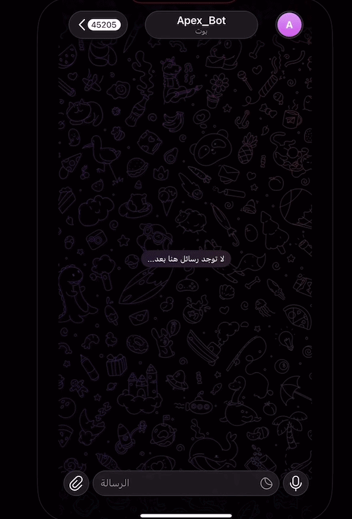

# Telegram Bot Integration with Oracle APEX

## Project Overview

This is an experimental Telegram Bot project integrated with Oracle APEX using the Telegram Bot API and PL/SQL.

The project demonstrates how Oracle APEX can communicate with Telegram, receive and process messages, manage user sessions, and handle user interactions using Oracle Database.

## Current Status

The bot currently provides multiple options for users.

**Currently implemented:**

* **Option 1: Orders** — Fully functional

**Planned:**

* Other options will be implemented in future development.

## Technologies Used

* Oracle APEX
* Oracle Database
* PL/SQL
* Telegram Bot API
* REST API
* JSON
* APEX_WEB_SERVICE
* APEX_JSON
* DBMS_SCHEDULER

## How It Works

1. The user interacts with the Telegram Bot.
2. Oracle APEX communicates with the Telegram Bot API.
3. The system retrieves new Telegram updates using `getUpdates`.
4. The JSON response is parsed using `APEX_JSON`.
5. The user's session state is identified and managed.
6. The selected option is processed using PL/SQL.
7. The bot sends a response back to the user using the Telegram API.
8. Messages and session information are stored in the database.
9. The latest processed `update_id` is stored to prevent duplicate processing.

## Main Components

### CHECK_TELEGRAM_MESSAGES

The main PL/SQL procedure responsible for handling incoming Telegram updates.

It is responsible for:

* Retrieving new Telegram messages.
* Parsing the JSON response.
* Extracting the `update_id`.
* Reading user messages.
* Processing user selections.
* Managing the conversation flow.
* Updating the latest processed `update_id`.

### SET_SESSION_STATE

A PL/SQL procedure responsible for managing the user's Telegram session state.

It updates the `TELEGRAM_SESSION` table to keep track of the current state or step of each user during the conversation.

This allows the bot to remember the user's current position and determine how the next message should be processed.

Example conversation flow:

```text
User
  ↓
Main Menu
  ↓
Option 1: Orders
  ↓
Order Selection
  ↓
Order Information
  ↓
Bot Response
```

### SEND_MESSAGE

A PL/SQL procedure responsible for sending messages to Telegram using the Telegram Bot API.

The procedure communicates with the Telegram `sendMessage` endpoint and also saves the sent message information in the database for tracking and conversation history.

Centralizing message sending in this procedure makes it easier to manage and reuse Telegram message functionality throughout the project.

## Session Management

The `TELEGRAM_SESSION` table is used to maintain the current state of each Telegram user.

The `SET_SESSION_STATE` procedure updates the session state whenever the conversation moves from one step to another.

This allows the bot to support multi-step conversations and determine what each incoming message means based on the user's current session state.

## Message Handling

The project stores Telegram message information in the database to maintain conversation history and track interactions between the user and the bot.

The system can track:

* Telegram users
* User messages
* Bot responses
* Conversation state
* Message history
* Processed updates

## Telegram API

The project uses the Telegram Bot API for communication between Telegram and Oracle APEX.

The main API methods used in the project are:

### getUpdates

Used to retrieve new messages and updates from Telegram.

### sendMessage

Used to send responses from Oracle APEX back to Telegram users.

## JSON Processing

Oracle APEX `APEX_JSON` is used to parse and extract information from Telegram API responses.

Example:

```sql
apex_json.parse(l_response);

l_count := apex_json.get_count('result');
```

The system then processes each update:

```sql
FOR i IN 1 .. l_count LOOP

    l_update_id := apex_json.get_number(
        p_path => 'result[%d].update_id',
        p0     => i
    );

END LOOP;
```

## Database Components

### TELEGRAM_BOT_CONTROL

Stores the latest processed Telegram `update_id`.

This prevents the system from processing the same Telegram update multiple times.

### TELEGRAM_SESSION

Stores the current session state for each Telegram user.

This allows the bot to maintain the user's position within the conversation and support multi-step interactions.

## Scheduled Job

A database scheduled job is used to execute the Telegram message checking process automatically.

The job periodically runs `CHECK_TELEGRAM_MESSAGES` to check for new Telegram updates.

This allows the bot to receive and process messages without requiring manual execution.

## Security

The Telegram Bot Token is not hardcoded in the project code.

The token is retrieved dynamically through a database function, keeping the actual token value separate from the source code and preventing it from being committed to GitHub.

Example:

```sql
l_token := GET_TELEGRAM_BOT_TOKEN();
```

The actual token value is stored and managed separately from the project source code.

```

## Project Goal

The goal of this experimental project is to explore the integration between Telegram and Oracle APEX using REST APIs, PL/SQL, JSON processing, session management, scheduled jobs, and database-driven conversation flows.

## Future Improvements

* Implement additional Telegram menu options.
* Expand the Orders functionality.
* Add interactive Telegram buttons.
* Support images and videos.
* Add more Telegram commands.
* Improve conversation state management.
* Store additional Telegram user information.
* Connect Telegram interactions with additional Oracle database operations.
* Add more advanced Telegram Bot features.


## Demo

The GIF below demonstrates the chat interface, dynamic chat status, message visibility, and file attachments.


